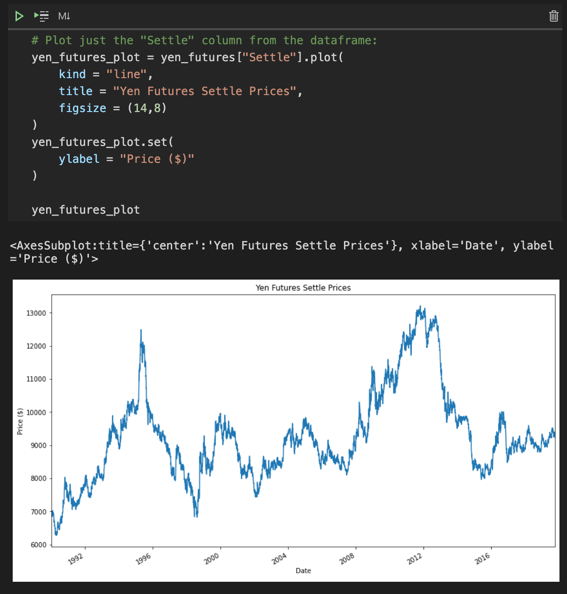
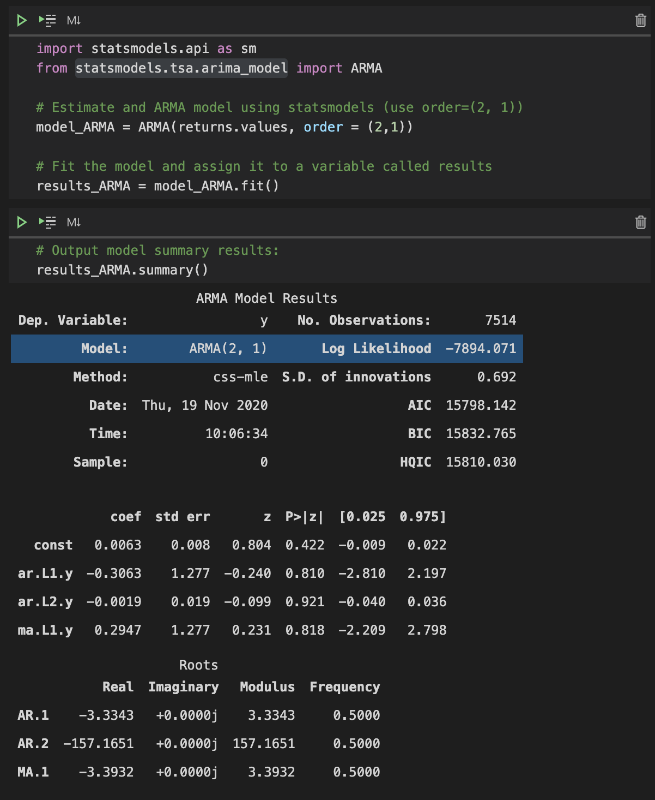
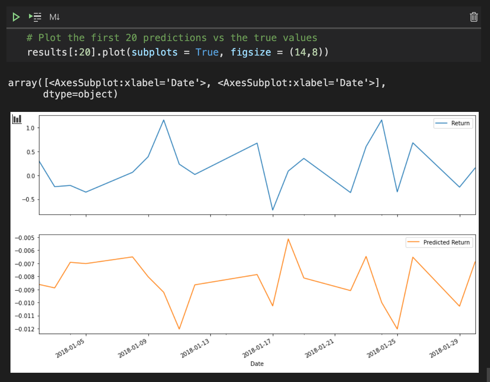

 image source - [www.scmp.com](https://www.scmp.com/sport/martial-arts/kung-fu/article/3039722/donnie-yen-confirms-ip-man-4-will-be-his-final-kung-fu)

# A Yen For The Future

Predict the future value of the Japanese Yen versus the U.S. dollar using time-series tools.

---

## Overview

---

## Installation

Need the following python libraries for Time-Series:
- numpy
- pandas
- Pathlib
- statsmodel.api
- statsmodels.tsa.arima_model
- arch

Need the following python libraries for Regression:
- numpy
- pandas
- Pathlib
- sklearn.linear_model
- sklearn.metrics

---

## Screenshots Time-Series Analysis

## Screenshots Regression Analysis

---

## Contributors

- Asif Meghani

Looking to contribute?
Contact me!

---

## Acknowledgements

Starter code and housing data has been provided by Rice University Trilogy Education Services

---

## Contact Me

linkedin - www.linkedin.com/in/asif-meghani-26a2a719

---

## License

MIT License